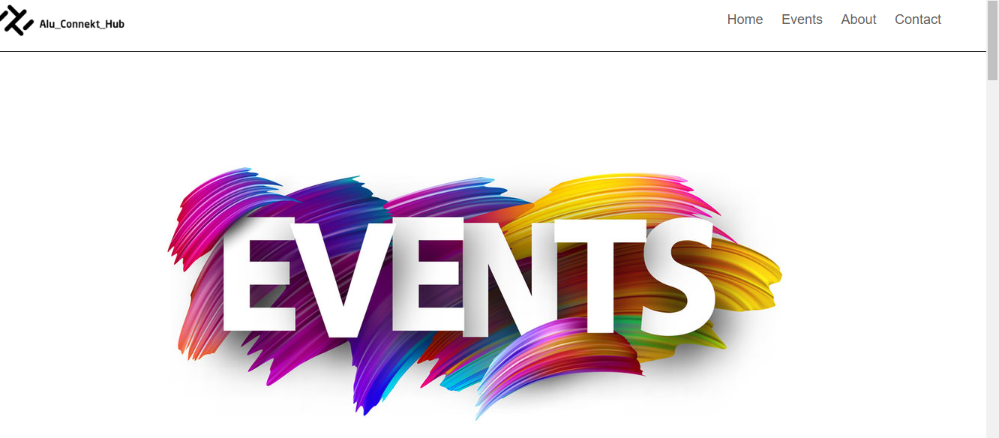
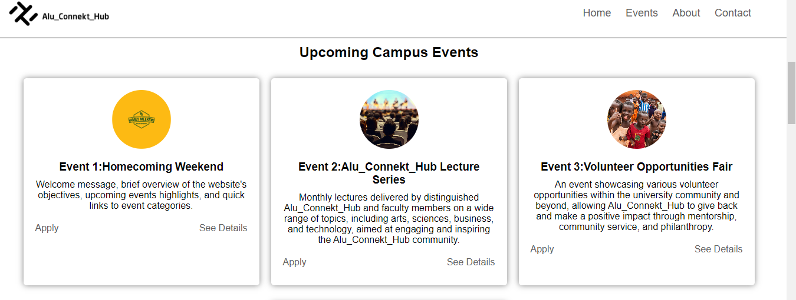
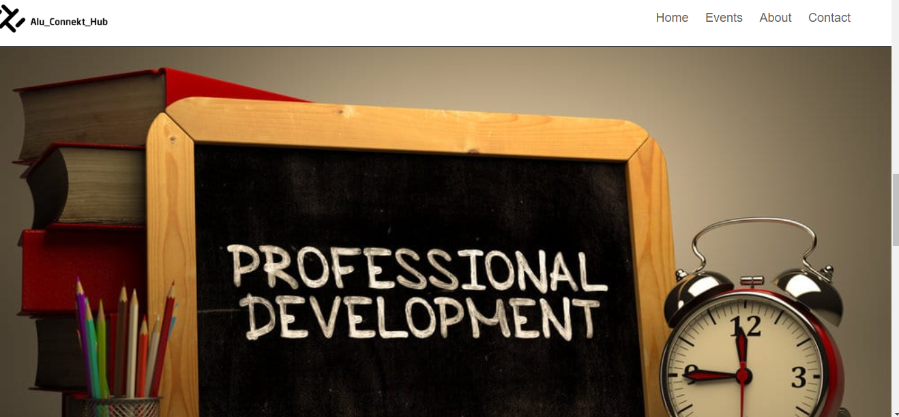
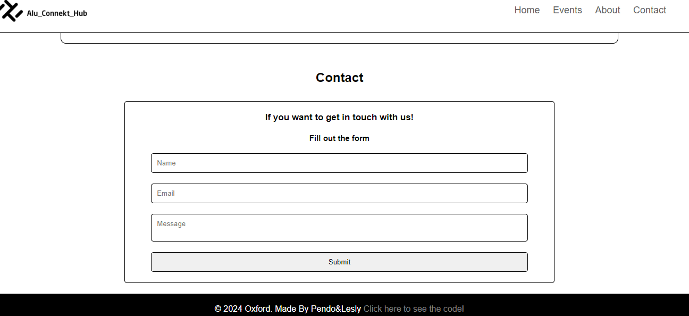

# HTML-CSS-Group12
This repository demonstrates a clone of Welcome to the Alu_Connekt_Hub website clone with Pure HTML and CSS. This repository connects Alu_Connekt_Hub and the broader community through events, professional development opportunities, and a platform to showcase their talents and achievements, and it's easy to understand the codes used.

## authors
**Lesly Ndayizeye**

**Vestine Pendo**

## Screen shots of website

[screan shot](screenshot/event4.png)

### Usage
### Steps
1.  step one clone Repository

     git clone https://github.com/vpendo/HTML-CSS-Group12.git

2. Step Two

    Open the HTML-CSS-Group12 folder in your downloads folder.

3. Step three

    open index.html in your browser
## License
   [MIT License] (LICENSE)

   Feel free to create Folks, and don't hesitate to reach out if you have any issues or ideas.
### Contact us
    Email:vpendo@alustudent.com
         :l.ndizeye@alustudent.com

    Phone: 0782030814
         :0782540966
         
## Welcome to the Alu_Connekt_Hub website! 

